# Container Isolation Plan - Installation and Apache in Web Container Only

## Problem Statement

Currently, all three Mautic containers (`mautic_web`, `mautic_cron`, `mautic_worker`) share the same Dockerfile and entrypoint script. This causes:

1. All containers check for installation and could potentially trigger installation
2. The entrypoint script attempts to start Apache in all containers
3. The `command` overrides in docker-compose.yaml prevent Apache from running in cron/worker, but the installation logic still executes

## Solution Overview

Add a container type detection mechanism to ensure:
- Installation only runs in the `mautic_web` container
- Apache only starts in the `mautic_web` container
- Cron and worker containers skip both installation and Apache startup

## Implementation Plan

### 1. Update docker-compose.yaml

Add `MAUTIC_CONTAINER_TYPE` environment variable to each Mautic service:

```yaml
mautic_web:
  environment:
    MAUTIC_CONTAINER_TYPE: web

mautic_cron:
  environment:
    MAUTIC_CONTAINER_TYPE: cron

mautic_worker:
  environment:
    MAUTIC_CONTAINER_TYPE: worker
```

### 2. Modify docker-entrypoint-custom.sh

Add container type detection at the beginning of the script:

```bash
# Container type detection
CONTAINER_TYPE="${MAUTIC_CONTAINER_TYPE:-web}"
```

Modify the main execution logic to skip installation and Apache in non-web containers:

```bash
# =========== MAIN EXECUTION ==========

# Only web container should handle installation and run Apache
if [ "$CONTAINER_TYPE" = "web" ]; then
    if is_installed; then
        echo "[mautic_entrypoint]: Existing Mautic installation detected."
        echo "[mautic_entrypoint]: Skipping installation, only updating code..."
        
        # Clear cache to pick up theme/plugin changes
        clear_cache
        
        # Fix permissions
        fix_permissions
        
        echo "[mautic_entrypoint]: Starting Apache..."
        exec apache2-foreground
    else
        echo "[mautic_entrypoint]: No existing installation found."
        
        # Check if we have required environment variables for automatic install
        if [ -n "$MAUTIC_DB_USER" ] && [ -n "$MAUTIC_DB_PASSWORD" ]; then
            echo "[mautic_entrypoint]: Database credentials found, running automatic installation..."
            run_automatic_install
        else
            echo "[mautic_entrypoint]: No database credentials found in environment."
            echo "[mautic_entrypoint]: Please set MAUTIC_DB_USER and MAUTIC_DB_PASSWORD for automatic installation."
            echo "[mautic_entrypoint]: Starting Apache for manual installation..."
            exec apache2-foreground
        fi
    fi
else
    # Non-web containers (cron, worker) - skip installation and Apache
    echo "[mautic_entrypoint]: Running as $CONTAINER_TYPE container - skipping installation and Apache"
    echo "[mautic_entrypoint]: Waiting for container command to execute..."
    
    # Just wait - the command from docker-compose will take over
    exec tail -f /dev/null
fi
```

## Architecture Diagram

```mermaid
flowchart TD
    subgraph Web Container
        A[Entry Point] --> B{Installed?}
        B -->|No| C[Run Installation]
        B -->|Yes| D[Clear Cache]
        C --> D
        D --> E[Fix Permissions]
        E --> F[Start Apache]
    end

    subgraph Cron Container
        G[Entry Point] --> H{Container Type?}
        H -->|cron| I[Skip Installation]
        I --> J[Skip Apache]
        J --> K[Execute Cron Loop]
    end

    subgraph Worker Container
        L[Entry Point] --> M{Container Type?}
        M -->|worker| N[Skip Installation]
        N --> O[Skip Apache]
        O --> P[Execute Messenger Consumer]
    end
```



## Files to Modify

1. `docker-compose.yaml` - Add MAUTIC_CONTAINER_TYPE environment variable
2. `docker-entrypoint-custom.sh` - Add container type detection and conditional logic

## Expected Behavior After Changes

| Container | Installation | Apache | Primary Function |
|-----------|-------------|---------|------------------|
| mautic_web | Yes | Yes | Web server |
| mautic_cron | No | No | Scheduled tasks |
| mautic_worker | No | No | Message queue consumer |
