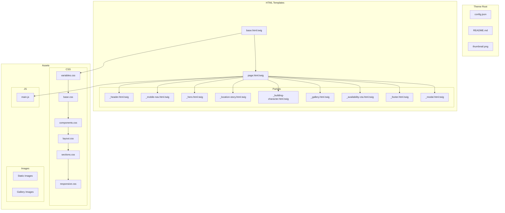
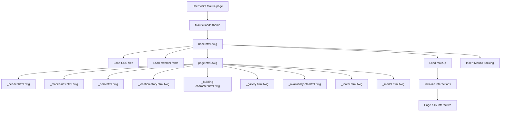

# Technical Plan: Mautic 1270 Logan Theme

## Executive Summary

This document provides a comprehensive technical plan for transforming the static HTML template at [`themes/1270-logan/index.html`](themes/1270-logan/index.html) into a production-ready Mautic page theme. The theme preserves the distinctive Victorian aesthetic while creating a modular, maintainable structure compatible with Mautic's theming system.

---

## 1. Source Analysis

### 1.1 HTML Structure Overview

The source template ([`themes/1270-logan/index.html`](themes/1270-logan/index.html)) contains:
- **Total Lines**: 1,251
- **Embedded CSS**: ~760 lines (lines 15-775)
- **Embedded JavaScript**: ~100 lines (lines 1150-1249)
- **HTML Content**: ~375 lines

### 1.2 Section Breakdown

| Section | ID | Lines | Description |
|---------|-----|-------|-------------|
| Header | `header` | 779-794 | Fixed navigation with logo and links |
| Mobile Nav | `mobileNav` | 797-804 | Responsive hamburger menu |
| Hero | - | 807-822 | Full-viewport hero with CTA |
| Location Story | `location` | 825-891 | Feature cards describing neighborhood |
| Building Character | `character` | 894-955 | Building details with amenity icons |
| Gallery | `gallery` | 958-1095 | 16-image grid with lightbox |
| Availability CTA | `availability` | 1098-1114 | Call-to-action section |
| Footer | - | 1117-1140 | Two-column footer with copyright |
| Modal | `imageModal` | 1143-1148 | Lightbox for gallery images |

### 1.3 Component Inventory

```
Components Identified:
├── Navigation
│   ├── Desktop navbar with logo
│   ├── Nav links list
│   ├── CTA button in nav
│   └── Mobile hamburger menu
├── Hero Section
│   ├── Hero content wrapper
│   └── Hero CTA button
├── Feature Cards (7 total)
│   └── Icon + Title + Subtitle + Description pattern
├── Detail Items (6 total)
│   └── Icon + Title pattern
├── Gallery
│   ├── Gallery grid container
│   └── Gallery items with thumbnail/full image pairs
├── Modal/Lightbox
│   ├── Overlay
│   ├── Close button
│   └── Image container
└── Footer
    ├── Footer columns
    ├── Social links
    └── Copyright
```

### 1.4 Design System Analysis

#### Color Palette (CSS Variables)
```css
--deep-burgundy: #5d2e3f;   /* Primary brand color */
--gold: #c9a66b;            /* Accent/CTA color */
--cream: #f5f0e6;           /* Background */
--dark-green: #2e5d3f;      /* Secondary accent */
--warm-gray: #8c8573;       /* Muted text */
--victorian-blue: #3a506b;  /* Tertiary accent */
```

#### Typography
- **Headings**: Playfair Display (serif) - weights 400, 700, 900
- **Body**: Montserrat (sans-serif) - weights 300, 400, 500, 600, 700

#### External Dependencies
- Font Awesome 6.4.0 (CDN)
- Google Fonts API

### 1.5 JavaScript Features

| Feature | Purpose | Lines |
|---------|---------|-------|
| Header scroll effect | Add shadow on scroll | 1152-1159 |
| Smooth scrolling | Anchor link navigation | 1162-1173 |
| Intersection Observer | Scroll animations | 1176-1196 |
| Image modal | Gallery lightbox | 1199-1231 |
| Mobile menu toggle | Hamburger menu | 1234-1248 |

### 1.6 Image Assets

**Location**: [`themes/1270-logan/images/`](themes/1270-logan/images/)

| Type | Count | Naming Pattern |
|------|-------|----------------|
| Hero background | 1 | `building-01.webp` |
| Building exterior | 2 | `hero_1U0A9837.webp`, `hero_1U0A9837_thumb.webp` |
| Gallery full | 16 | `1U0AXXXX.webp` |
| Gallery thumbnails | 16 | `1U0AXXXX_thumb.webp` |
| **Total** | **35** | - |

---

## 2. Theme Architecture

### 2.1 Directory Structure

```
themes/1270-logan-mautic/
├── config.json              # Theme metadata and configuration
├── README.md                # Documentation
├── thumbnail.png            # Theme preview image (300x200px recommended)
│
├── html/                    # Twig templates
│   ├── base.html.twig       # Base HTML document structure
│   ├── page.html.twig       # Main page template
│   └── partials/            # Reusable template components
│       ├── _header.html.twig
│       ├── _mobile-nav.html.twig
│       ├── _hero.html.twig
│       ├── _location-story.html.twig
│       ├── _building-character.html.twig
│       ├── _gallery.html.twig
│       ├── _availability-cta.html.twig
│       ├── _footer.html.twig
│       └── _modal.html.twig
│
├── css/                     # Stylesheets
│   ├── variables.css        # CSS custom properties
│   ├── base.css             # Reset and typography
│   ├── components.css       # Reusable component styles
│   ├── layout.css           # Grid and structure
│   ├── sections.css         # Section-specific styles
│   └── responsive.css       # Media queries
│
├── js/                      # JavaScript
│   └── main.js              # All interactions
│
└── images/                  # Static assets
    ├── building-01.webp
    ├── hero_1U0A9837.webp
    ├── hero_1U0A9837_thumb.webp
    └── gallery/             # Gallery images organized
        ├── 1U0A0008.webp
        ├── 1U0A0008_thumb.webp
        └── ... (remaining gallery images)
```

### 2.2 Architecture Diagram



---

## 3. Template Structure

### 3.1 Base Template (`base.html.twig`)

The base template extends Mautic's core template and provides the HTML document structure.

**Responsibilities**:
- HTML5 doctype and language attribute
- Meta tags (charset, viewport, description)
- External resource loading (fonts, icons)
- CSS stylesheet references
- JavaScript loading with defer
- Mautic tracking code insertion point
- Content block definition

**Key Blocks**:
```twig
    {# CSS stylesheets #}
     {# Main page content #}
   {# JavaScript files #}
    {# Mautic tracking pixel #}
```

### 3.2 Page Template (`page.html.twig`)

The main page template assembles all partials in order.

**Structure**:
```twig



    
    
    
    
    
    
    
    
    

```

### 3.3 Partial Templates

Each partial is self-contained and receives data through Twig variables:

| Partial | Variables | Purpose |
|---------|-----------|---------|
| `_header.html.twig` | `logo_text`, `nav_items` | Fixed navigation |
| `_mobile-nav.html.twig` | `nav_items` | Responsive menu |
| `_hero.html.twig` | `hero_title`, `hero_subtitle`, `cta_url`, `cta_text`, `hero_bg` | Hero section |
| `_location-story.html.twig` | `section_title`, `features[]` | Feature cards |
| `_building-character.html.twig` | `section_title`, `details[]` | Amenity icons |
| `_gallery.html.twig` | `section_title`, `images[]` | Image grid |
| `_availability-cta.html.twig` | `cta_title`, `cta_text`, `cta_url` | CTA section |
| `_footer.html.twig` | `columns[]`, `copyright` | Footer content |
| `_modal.html.twig` | - | Lightbox structure |

---

## 4. CSS Organization

### 4.1 File Breakdown

#### `variables.css` (~30 lines)
Extract CSS custom properties for theming:
```css
:root {
  /* Colors */
  --deep-burgundy: #5d2e3f;
  --gold: #c9a66b;
  --cream: #f5f0e6;
  --dark-green: #2e5d3f;
  --warm-gray: #8c8573;
  --victorian-blue: #3a506b;
  
  /* Typography */
  --font-heading: 'Playfair Display', serif;
  --font-body: 'Montserrat', sans-serif;
  
  /* Spacing */
  --section-padding: 80px;
  --container-width: 1200px;
  
  /* Shadows */
  --shadow-sm: 0 2px 10px rgba(0, 0, 0, 0.1);
  --shadow-md: 0 5px 15px rgba(0, 0, 0, 0.1);
  --shadow-lg: 0 10px 30px rgba(0, 0, 0, 0.1);
  
  /* Transitions */
  --transition-fast: 0.3s ease;
  --transition-slow: 0.5s ease;
}
```

#### `base.css` (~80 lines)
- CSS reset/normalize
- Typography rules (headings, body text)
- Link styles
- Container class
- Button base styles

#### `components.css` (~200 lines)
- `.btn` and `.btn:hover`
- `.feature-card`
- `.detail-item`
- `.gallery-item`
- `.testimonial-card` (if needed)
- `.social-links`
- `.section-title`

#### `layout.css` (~100 lines)
- Header/navbar layout
- Grid systems
- Flexbox utilities
- Container constraints

#### `sections.css` (~250 lines)
- Hero section styles
- Location story section
- Building character section
- Gallery section
- CTA section
- Footer section

#### `responsive.css` (~100 lines)
- 768px breakpoint rules
- 480px breakpoint rules
- Mobile navigation styles

### 4.2 CSS Import Order

```css
/* In base.html.twig */
<link rel="stylesheet" href="{{ getAssetUrl('themes/1270-logan-mautic/css/variables.css') }}">
<link rel="stylesheet" href="{{ getAssetUrl('themes/1270-logan-mautic/css/base.css') }}">
<link rel="stylesheet" href="{{ getAssetUrl('themes/1270-logan-mautic/css/components.css') }}">
<link rel="stylesheet" href="{{ getAssetUrl('themes/1270-logan-mautic/css/layout.css') }}">
<link rel="stylesheet" href="{{ getAssetUrl('themes/1270-logan-mautic/css/sections.css') }}">
<link rel="stylesheet" href="{{ getAssetUrl('themes/1270-logan-mautic/css/responsive.css') }}">
```

---

## 5. JavaScript Organization

### 5.1 Single File Approach (`main.js`)

All JavaScript consolidated into one file with clear sections:

```javascript
/**
 * 1270 Logan Theme - Main JavaScript
 * 
 * Features:
 * - Header scroll effect
 * - Smooth scrolling navigation
 * - Scroll-triggered animations
 * - Gallery lightbox modal
 * - Mobile menu toggle
 */

document.addEventListener('DOMContentLoaded', function() {
  // Initialize all features
  initHeaderScroll();
  initSmoothScrolling();
  initScrollAnimations();
  initGalleryModal();
  initMobileMenu();
});

// Feature implementations...
```

### 5.2 Feature Functions

| Function | Lines | Responsibility |
|----------|-------|----------------|
| `initHeaderScroll()` | ~15 | Add/remove `.header-scrolled` class |
| `initSmoothScrolling()` | ~15 | Handle anchor link clicks |
| `initScrollAnimations()` | ~20 | Intersection Observer setup |
| `initGalleryModal()` | ~35 | Modal open/close/keyboard handling |
| `initMobileMenu()` | ~15 | Hamburger toggle and link click handling |

---

## 6. Configuration

### 6.1 `config.json` Structure

```json
{
  "name": "1270 Logan Victorian",
  "author": "Your Organization",
  "authorUrl": "https://example.com",
  "description": "A Victorian-styled page theme featuring a luxury apartment property design with hero section, feature cards, image gallery with lightbox, and responsive navigation.",
  "version": "1.0.0",
  "builder": ["legacy", "grapesjsbuilder"],
  "features": ["page"],
  "screenshots": ["screenshot1.png"],
  "onlyForBC": false
}
```

### 6.2 Configuration Fields Explained

| Field | Type | Description |
|-------|------|-------------|
| `name` | string | Display name in Mautic theme selector |
| `author` | string | Theme creator name |
| `authorUrl` | string | Link to author website |
| `description` | string | Brief theme description |
| `version` | string | Semantic version number |
| `builder` | array | Compatible page builders |
| `features` | array | Theme capabilities (`page`, `email`, `form`) |
| `screenshots` | array | Preview image filenames |
| `onlyForBC` | boolean | Business Contact restriction |

---

## 7. Mautic Integration Points

### 7.1 Tracking Code Insertion

```twig
{# In base.html.twig, before </body> #}

    {{ mauticContent() }}

```

### 7.2 Dynamic Content Areas

| Location | Mautic Variable | Purpose |
|----------|-----------------|---------|
| Page title | `{{ page.title }}` | Dynamic page title |
| Meta description | `{{ page.metaDescription }}` | SEO meta |
| Main content | `{{ content\|raw }}` | Editor content |
| Custom fields | `{{ page.customField }}` | Custom data |

### 7.3 Form Integration Points

The CTA sections can include Mautic forms:
```twig
{# In _availability-cta.html.twig #}

    {{ form|raw }}

    <a href="{{ cta_url }}" class="btn">{{ cta_text }}</a>

```

### 7.4 Asset URL Helper

Use Mautic's asset helper for proper URL generation:
```twig
{{ getAssetUrl('themes/1270-logan-mautic/images/building-01.webp') }}
```

---

## 8. Maintainability Strategy

### 8.1 Naming Conventions

#### CSS Classes
- **BEM-inspired**: `.block__element--modifier`
- **Section prefix**: `.hero-*`, `.gallery-*`, `.footer-*`
- **State classes**: `.is-active`, `.is-visible`, `.is-scrolled`

#### File Naming
- Partials prefixed with underscore: `_header.html.twig`
- CSS files lowercase with hyphens: `base.css`, `responsive.css`
- Images use original naming (photographer reference)

### 8.2 Documentation Approach

Each file includes a header comment block:
```css
/**
 * 1270 Logan Theme - Variables
 * 
 * CSS Custom Properties for theming consistency.
 * Modify these values to customize the color palette,
 * typography, and spacing throughout the theme.
 */
```

### 8.3 Version Control Considerations

- Keep original source in `themes/1270-logan/` (reference)
- New theme in `themes/1270-logan-mautic/` (production)
- Document changes from source in README.md

---

## 9. Implementation Checklist

### Phase 1: Directory Structure
- [ ] Create `themes/1270-logan-mautic/` directory
- [ ] Create subdirectories: `html/`, `html/partials/`, `css/`, `js/`, `images/`, `images/gallery/`
- [ ] Copy and organize image assets
- [ ] Create `config.json`
- [ ] Create `README.md`
- [ ] Generate `thumbnail.png` (300x200 screenshot)

### Phase 2: CSS Extraction
- [ ] Create `variables.css` with CSS custom properties
- [ ] Create `base.css` with reset and typography
- [ ] Create `components.css` with reusable component styles
- [ ] Create `layout.css` with grid and flexbox utilities
- [ ] Create `sections.css` with section-specific styles
- [ ] Create `responsive.css` with media queries
- [ ] Test CSS loads correctly in isolation

### Phase 3: Twig Templates
- [ ] Create `base.html.twig` extending Mautic core
- [ ] Create `page.html.twig` with partial includes
- [ ] Create `_header.html.twig` partial
- [ ] Create `_mobile-nav.html.twig` partial
- [ ] Create `_hero.html.twig` partial
- [ ] Create `_location-story.html.twig` partial
- [ ] Create `_building-character.html.twig` partial
- [ ] Create `_gallery.html.twig` partial
- [ ] Create `_availability-cta.html.twig` partial
- [ ] Create `_footer.html.twig` partial
- [ ] Create `_modal.html.twig` partial

### Phase 4: JavaScript
- [ ] Create `main.js` with all features
- [ ] Implement `initHeaderScroll()`
- [ ] Implement `initSmoothScrolling()`
- [ ] Implement `initScrollAnimations()`
- [ ] Implement `initGalleryModal()`
- [ ] Implement `initMobileMenu()`
- [ ] Test all interactions work correctly

### Phase 5: Integration & Testing
- [ ] Verify theme appears in Mautic theme selector
- [ ] Test page rendering in Mautic
- [ ] Test Mautic form integration
- [ ] Test tracking code insertion
- [ ] Cross-browser testing (Chrome, Firefox, Safari, Edge)
- [ ] Mobile responsiveness testing
- [ ] Lighthouse audit for performance

---

## 10. Template Flow Diagram



---

## 11. Risk Considerations

| Risk | Mitigation |
|------|------------|
| Mautic version compatibility | Test with target Mautic version; use documented APIs only |
| External CDN dependency | Include fallback fonts; consider self-hosting Font Awesome |
| Image loading performance | Use lazy loading; keep thumbnails for gallery |
| CSS specificity conflicts | Use scoped class names; avoid !important |
| JavaScript conflicts | Use IIFE or module pattern; namespace functions |

---

## 12. Success Criteria

1. **Visual Fidelity**: Theme renders identically to source HTML
2. **Mautic Integration**: Theme appears in selector and pages render correctly
3. **Form Support**: Mautic forms can be embedded in CTA sections
4. **Tracking**: Mautic tracking pixel loads on all pages
5. **Responsive**: All breakpoints work as in source
6. **Performance**: Page load under 3 seconds on 3G
7. **Maintainability**: Clear separation of concerns; documented code

---

## Appendix A: Source File Quick Reference

| Source Location | Description |
|-----------------|-------------|
| [`themes/1270-logan/index.html`](themes/1270-logan/index.html) | Complete source template |
| [`themes/1270-logan/images/`](themes/1270-logan/images/) | Image assets |
| [`themes/my-page-theme/`](themes/my-page-theme/) | Mautic theme structure reference |
| [`skills/frontend-design/SKILL.md`](skills/frontend-design/SKILL.md) | Design principles |

## Appendix B: CSS Line Mapping

For reference when extracting CSS from the source:

| Section | Source Lines | Target File |
|---------|--------------|-------------|
| CSS Variables | 16-23 | `variables.css` |
| Reset & Base | 25-96 | `base.css` |
| Header/Nav | 98-224 | `layout.css` |
| Hero | 227-285 | `sections.css` |
| Location Story | 288-355 | `sections.css` |
| Building Character | 358-417 | `sections.css` |
| Gallery | 419-475 | `sections.css` |
| Modal | 478-521 | `components.css` |
| Testimonials | 524-595 | `sections.css` |
| CTA Section | 597-621 | `sections.css` |
| Footer | 624-700 | `sections.css` |
| Responsive | 704-774 | `responsive.css` |
