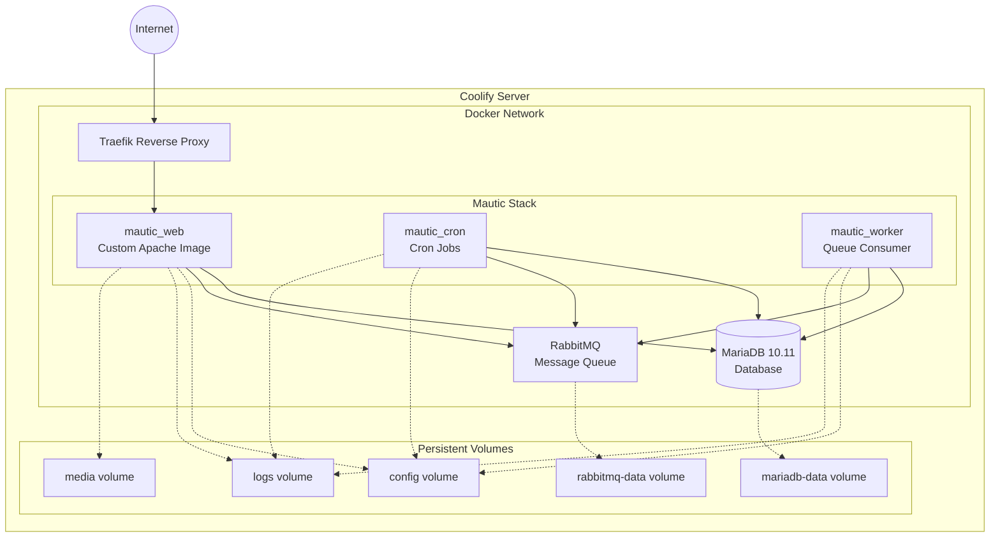
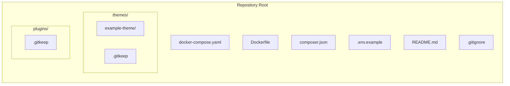
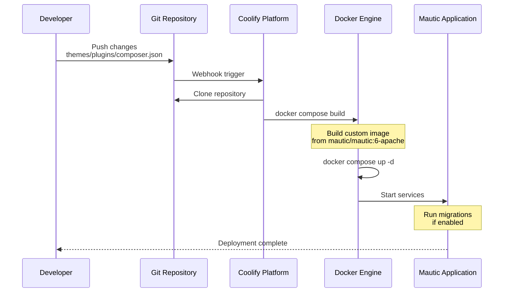

# Mautic Coolify Service Implementation Plan

## Overview

This plan describes the creation of a production-ready Coolify service configuration for self-hosted Mautic 6 with support for custom themes and plugins through a git-based workflow.

## Reference

**Official Coolify Mautic 5 Template**: https://raw.githubusercontent.com/coollabsio/coolify/refs/heads/v4.x/templates/compose/mautic5.yaml

This template serves as the foundation for our implementation, adapted for Mautic 6 with MariaDB.

## Configuration Choices

| Setting | Value | Rationale |
|---------|-------|-----------|
| Mautic Version | `mautic/mautic:6-apache` | Latest stable version with PHP 8.3 |
| Database | MariaDB 10.11 | Open source, MySQL-compatible |
| Message Queue | RabbitMQ 3 | Reliable async processing |
| Composer Packages | `symfony/amazon-mailer` | AWS SES email integration |
| Theme Example | Minimal structure | Reference implementation |

## Research Summary

### Official Coolify Mautic 5 Template Analysis
From the reference template:
- Uses RabbitMQ for async message queuing with vhost `mautic`
- Deploys **three Mautic containers**: `mautic_web`, `mautic_cron`, `mautic_worker`
- Coolify-specific environment variable patterns:
  - `SERVICE_PASSWORD_64_*` - Auto-generated 64-char passwords
  - `SERVICE_USER_*` - Auto-generated usernames
  - `SERVICE_URL_MAUTIC_80` - Auto-generated public URL
- Volume mounts for: config, logs, media/files, media/images, plugins, vendor, bin, cron
- Health checks for all services
- Uses `DOCKER_MAUTIC_ROLE` environment variable to set container role

### Mautic Docker Image Customization
- Official documentation states: *Currently this image has no easy way to extend Mautic. Build your own images based on the official ones.*
- Apache variant is **recommended** over FPM
- Composer is pre-installed in the image
- Mautic 6.x uses PHP 8.3 (bookworm base)
- Key paths:
  - `/var/www/html` - Application root
  - `/var/www/html/docroot/plugins` - Plugins directory
  - `/var/www/html/docroot/themes` - Themes directory
  - `/var/www/html/vendor` - Composer dependencies

### Mautic Theme Structure (from developer docs)
- `config.json` - Theme metadata with name, author, features
- `html/email.html.twig` - Email template using Twig
- Features can include: `page`, `email`, `form`

### Mautic Plugin Structure (from developer docs)
- `{PluginName}Bundle.php` - Main bundle class extending `PluginBundleBase`
- `Config/config.php` - Plugin configuration with name, description, version
- Located in `/var/www/html/docroot/plugins/{PluginName}Bundle/`

### Coolify Git Deployment Format
- Supports `docker-compose.yaml` with `build:` directive
- Auto-detects Dockerfile and builds images
- Special environment variable syntax for service-generated values
- Automatically handles Traefik routing and SSL
- `is_directory: true` hint for volume pre-creation

## Architecture

### System Architecture Diagram



### Git Repository Structure



### Deployment Workflow



## File Specifications

### 1. Dockerfile

**Purpose**: Extend official `mautic/mautic:6-apache` image with custom themes, plugins, and composer dependencies.

**Base Image**: `mautic/mautic:6-apache` (PHP 8.3, Debian Bookworm)

**Key features**:
- Copies `composer.json` and runs `composer install` for additional packages
- Copies custom themes from `./themes/` to `/var/www/html/docroot/themes/`
- Copies custom plugins from `./plugins/` to `/var/www/html/docroot/plugins/`
- Sets proper file ownership for `www-data` user
- Clears cache to ensure fresh state

### 2. docker-compose.yaml

**Purpose**: Coolify-compatible service definition based on the official Mautic 5 template, adapted for Mautic 6.

**Reference**: https://raw.githubusercontent.com/coollabsio/coolify/refs/heads/v4.x/templates/compose/mautic5.yaml

**Services**:
| Service | Image | Role | Health Check |
|---------|-------|------|--------------|
| mariadb | mariadb:10.11 | Database | healthcheck.sh |
| rabbitmq | rabbitmq:3 | Message Queue | rabbitmq-diagnostics ping |
| mautic_web | Custom build from `mautic/mautic:6-apache` | Web server | curl http://localhost |
| mautic_cron | Custom build from `mautic/mautic:6-apache` | Cron runner | exit 0 |
| mautic_worker | Custom build from `mautic/mautic:6-apache` | Queue worker | exit 0 |

**Environment Variables** using Coolify patterns:
- `SERVICE_PASSWORD_64_MARIADBROOT` - Auto-generated MariaDB root password
- `SERVICE_PASSWORD_64_MARIADB` - Auto-generated MariaDB user password
- `SERVICE_USER_MARIADB` - Auto-generated MariaDB username
- `SERVICE_URL_MAUTIC_80` - Auto-generated public URL

**Key differences from official template**:
- Uses custom `build:` directive instead of `image: mautic/mautic:latest`
- MariaDB 10.11 instead of MySQL 8.0
- All three Mautic services share the same custom-built image

### 3. composer.json

**Purpose**: Define additional composer dependencies.

**Contents**:
- `symfony/amazon-mailer` - For AWS SES email integration

### 4. Directory Structure

```
mautic-coolify3/
├── docker-compose.yaml          # Coolify service definition
├── Dockerfile                   # Custom image extending mautic/mautic:6-apache
├── composer.json                # Additional dependencies
├── .env.example                 # Environment variable template
├── .gitignore                   # Git ignore rules
├── README.md                    # Documentation
├── themes/                      # Custom themes
│   ├── .gitkeep
│   └── example-theme/           # Minimal example theme
│       ├── config.json
│       └── html/
│           └── email.html.twig
└── plugins/                     # Custom plugins
    └── .gitkeep
```

### 5. Example Theme Structure

Based on Mautic developer documentation:

```
themes/example-theme/
├── config.json                  # Theme metadata
└── html/
    └── email.html.twig          # Email template
```

**config.json example**:
```json
{
  "name": "Example Theme",
  "author": "Your Name",
  "authorUrl": "https://example.com",
  "features": ["email"]
}
```

### 6. README.md

**Purpose**: Comprehensive documentation for users.

**Sections**:
1. Quick Start Guide
2. Adding Custom Themes
3. Adding Custom Plugins
4. Adding Composer Dependencies
5. Coolify Configuration Steps
6. Rebuild and Redeploy Workflow
7. Environment Variables Reference
8. Troubleshooting

## Implementation Notes

### Coolify-Specific Considerations

1. **Build Context**: Coolify will detect the Dockerfile and build the custom image from `mautic/mautic:6-apache` automatically
2. **Environment Variables**: Use Coolify patterns for auto-generated secrets
3. **Port Exposure**: Do NOT expose ports in docker-compose; Coolify handles via Traefik
4. **Domain Configuration**: Set via `SERVICE_URL_MAUTIC_80` or Coolify UI
5. **Persistent Storage**: Define volumes for data that must survive rebuilds

### Security Best Practices

1. All passwords use Coolify's 64-character auto-generated secrets
2. Database is not exposed publicly
3. RabbitMQ is internal only
4. File permissions set to www-data ownership
5. No sensitive defaults in committed files

### Upgrade Path

To upgrade Mautic version:
1. Update `FROM mautic/mautic:6.X-apache` in Dockerfile (e.g., `6.1-apache`)
2. Commit and push to git
3. Trigger rebuild in Coolify
4. Migrations run automatically if `DOCKER_MAUTIC_RUN_MIGRATIONS=true`

## Success Criteria

- [ ] Single git push deploys complete Mautic 6 stack
- [ ] Custom themes visible in Mautic theme selector
- [ ] Custom plugins activatable in Mautic admin
- [ ] Composer dependencies properly installed (symfony/amazon-mailer)
- [ ] All three services (web, cron, worker) running and healthy
- [ ] MariaDB 10.11 database operational
- [ ] Data persists across rebuilds
- [ ] Clear documentation for adding themes/plugins
